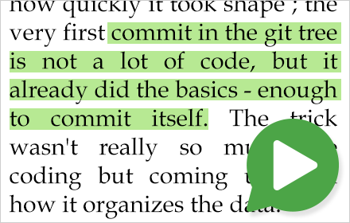

<p align="center">
  <a href="https://joelpurra.com/projects/talkie/"></a>
</p>
<h1 align="center">
  <a href="https://joelpurra.com/projects/talkie/">Talkie</a>
</h1>
<p align="center">
  Text-to-speech browser extension button
</p>
<table>
  <tr>
    <td align="center">
      <a href="https://chrome.google.com/webstore/detail/enfbcfmmdpdminapkflljhbfeejjhjjk"><br />Talkie</a><br />&nbsp;
    </td>
    <td align="center">
      <a href="https://chrome.google.com/webstore/detail/madmpgibncancdmkjflnifcdakndkngo"><br />Talkie Premium</a><br />&nbsp;
    </td>
    <td align="center">
      <a href="https://addons.mozilla.org/en-US/firefox/addon/talkie/"><br />Talkie</a><br />&nbsp;
    </td>
    <td align="center">
      <a href="https://joelpurra.com/projects/talkie/#premium"></a><br />Talkie Premium<br />(Coming soon!)
    </td>
  </tr>
</table>


# Developer documentation

- Find the source code in the [Talkie repository on Github](https://github.com/joelpurra/talkie).
- Use the `develop` branch as the base for your pull request.
- Follow git-flow, preferably using  [`git-flow`](http://danielkummer.github.io/git-flow-cheatsheet/).
- It is recommended to use [`hub`](https://hub.github.com/) for forking and creating pull requests on github.
- All project contributors need to agree to the the [Contributor License Agreement (CLA)](CLA.md).


## Manual installation

- Clone the repository.
- Build the code using commands below.
- From the browser extensions settings page:
  - Enable developer mode.
  - Load one of the package folders as an unpacked extension.
    - `package/chrome/` for Google Chrome, Chromium, Vivaldi, and similar browsers.
    - `package/webextension/` for Firefox, and other browsers.


## Building

```bash
# Go to the directory where you cloned the repository.
cd talkie

# Install local development tools.
npm install

# Do a clean build.
npm run --silent rebuild
```


## Debugging

- From the browser extensions settings page:
  - Enable developer mode.
  - Inspect the Talkie background page view to see console output.
- It is possible to coarsely adjust the console logging level.
  - In the background page console, enter one of these logging level commands:
    - `this.setLoggingLevel("TRAC");` (maximum logging)
    - `this.setLoggingLevel("DEBG");` (default for developers)
    - `this.setLoggingLevel("INFO");`
    - `this.setLoggingLevel("WARN");` (default for normal usage)
    - `this.setLoggingLevel("ERRO");`
    - `this.setLoggingLevel("NONE");` (no logging)
- You can also inspect the popup and options pages separately, to find problems specific to those parts. Most of the logging is duplicated to the background page console for an overview.
- Optionally add breakpoints in the source code.


```bash
# Open a new instance of Chrome, with an empty profile, and load Talkie.
# NOTE: assumes you have `google-chrome` in your path.
npm run --silent run:chrome:free

# Open a new instance of Firefox, with an empty profile, and load Talkie in debugging mode.
npm run --silent run:firefox:free

# You might need to set the path to Firefox.
#WEB_EXT_FIREFOX="$HOME/Applications/Firefox.app/Contents/MacOS/firefox-bin" npm run --silent run:firefox:free
```


## Translations

In order to offer Talkie in as many languages as possible, translations are automated. It is still possible &mdash; and preferred &mdash; to add overrides with human translations.


### Human translations

- All message changes have to be reflected in `_locales/en/base.json`, which is the base for all other languages.
- Translations can be done by editing or adding `override.json` for the desired locale in the `_locales` directory.
- In case of doubt, please refer to `_locales/en/base.json` as the one source of truth when it comes to original message strings and descriptions.


### Automated file mangling

- The `messages.json` for each language is assembled by `npm run --silent messages:refresh`. It is fast enough for development change-test-change cycles.
- All English base strings in `_locales/en/base.json` are automatically translated to all other languages by `npm run --silent messages:download`. It takes 1-3 minutes to translate all languages, and is too slow to use repeatedly during development. English is the easiest language to use during development.
- Translation scripts require a [Google Cloud Translation API key](https://cloud.google.com/translate/), [`jq`](https://stedolan.github.io/jq/manual/), and some shell magic.
- Automated file mangling is done by package maintainers using `npm run --silent messages:translate` before each release where the have been text changes.


### Translation file order

Translation files are merged in this order. The last value for a specific key/name wins, which means the messages in `override.json` are the most important.

1. Non-translated strings from `_locales/en/untranslated.json`.
1. Depends on the language; English has no modifications and uses the base:
  - Non-translated strings from `_locales/en/base.json`.
  - Translated strings from `_locales/*/automatic.json`.
1. Manual entries from `_locales/*/manual.json`.
1. Overrides from `_locales/*/override.json`.


## Pull request procedure

- These steps assume you are using the `hub` and `git-flow` tools.
- Expect to have your contribution scrutinized, so make sure your code is well-written. You may be asked to fix some stuff before your pull request is accepted.

```bash
# Fork the repository to your user on github.
hub fork

# Switch to develop.
git checkout develop

# Start a new feature. Us a descriptive "<feature-name>", such as "automatic-language-detection".
git flow feature start <feature-name>

# Watch the source files for changes. You can also run each command separately; see package.json.
npm run --silent watch

# Code your feature and add the files.
# Manually reload and test the code in the browser.
# Manually test all Talkie features:
#   - The Talkie button.
#   - Shortcut keys.
#   - Right click context menu.
#   - Options page.
#   - Language detection in more than one language.
#   - (Any features which might not have been added to this list.)
#   - (Any feature change you may have changed/added.)
# Test in the supported browsers:
#   - Google Chrome.
#   - Firefox.
#   - Preferably other browsers as well.

# Make sure the code builds.
npm run --silent rebuild

# Fix any warnings and errors before committing.
npm run --silent test

# Commit your changes. Use a descriptive commit message, preferably with more than one line of text.
git commit

# Finish the feature.
git flow feature finish <feature-name>

# Publish the feature to your fork.
git flow feature publish <feature-name>

# Go to the repository page to create a pull request against the develop branch.
hub browse
```


## Release procedure

These steps are only done by the project owner.

```bash
# Finish up any features, switch to develop.
git checkout develop

# Ensure all strings have been translated.
# Check the diff as well as the final per-key message string count.
npm run --silent messages:translate

# Ensure all files are included -- or excluded -- in the packaged extension.
# This includes new code files/translations/resources added/removed since the last release.
cat extension-files.txt

# Fix any warnings and errors before committing.
npm run --silent prepackage

# The "<release-version>" needs to follow semantic versioning, such as "v1.0.0".
# http://semver.org/
git flow release start <release-version>

# Update files to contain the version number.
npm run --silent version:update

# Finish the release and sign the tag.
git flow release finish -s <release-version>

# Create a zip file with the extension package.
npm run --silent package

# Upload and publish the package.
npm run --silent chromestore
```


---

<a href="https://joelpurra.com/projects/talkie/">Talkie</a> Copyright &copy; 2016, 2017 [Joel Purra](https://joelpurra.com/). Released under [GNU General Public License version 3.0 (GPL-3.0)](https://www.gnu.org/licenses/gpl.html). [Your donations are appreciated!](https://joelpurra.com/donate/)
