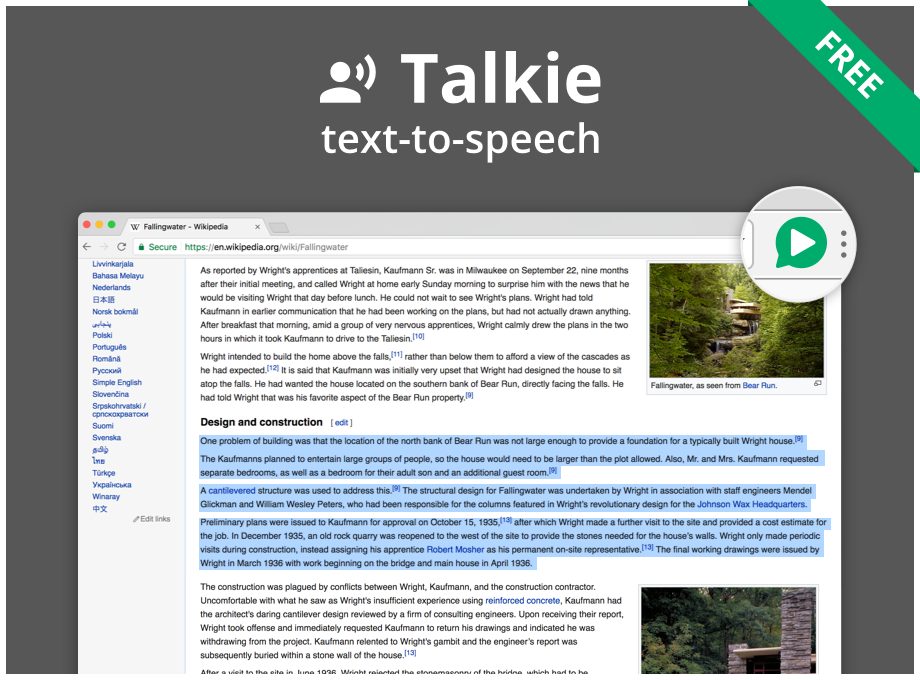
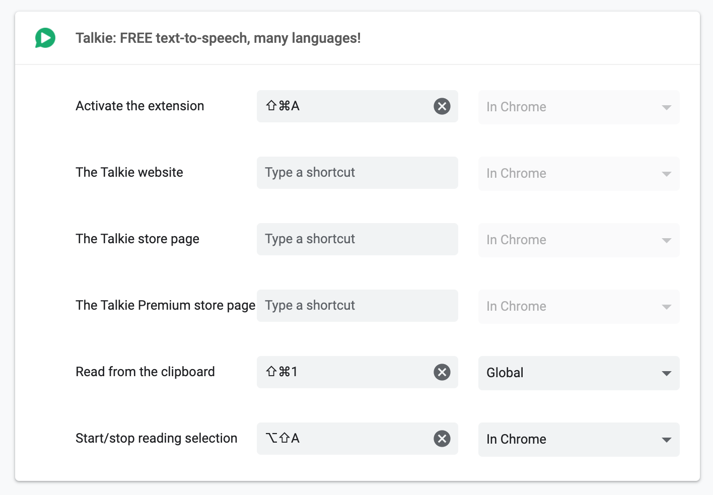
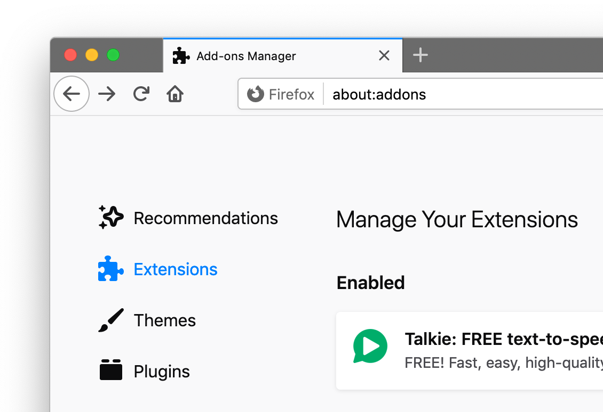
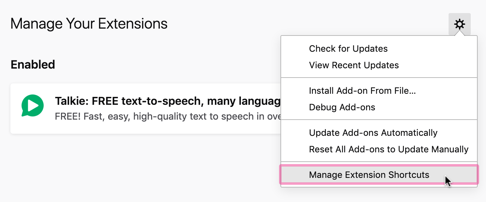
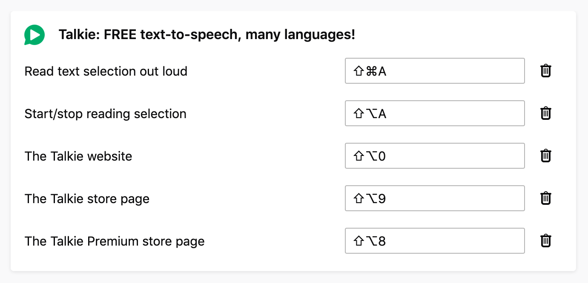

  

<h1 align="center">
  <a href="https://joelpurra.com/projects/talkie/">Talkie</a>
</h1>

  Text-to-speech browser extension button

## Installation

<table>
  <tr>
    <td align="center">
      <a href="https://chrome.google.com/webstore/detail/enfbcfmmdpdminapkflljhbfeejjhjjk">  Talkie</a> &nbsp;
    </td>
    <td align="center">
      <a href="https://addons.mozilla.org/en-US/firefox/addon/talkie/">  Talkie</a> &nbsp;
    </td>
  </tr>
</table>

Developer option: [use the source code](./DEVELOP.md) directly.

## Talkie Premium

-  **Talkie:** free to use as much as you like
-  **Talkie Premium:** [pay what you want](https://www.paypal.me/joelpurrade) for [more options and features](#features)

How much does Talkie Premium cost? You _choose_ how much you want to pay, depending on how much the additional features are worth to you. You can even choose to pay nothing. Afterwards, enable Talkie Premium in the Upgrade tab in Talkie's options.

[Send your payment through PayPal](https://www.paypal.me/joelpurrade) or see [more payment methods](https://joelpurra.com/donate/) on the donations page. Payments are labeled as donations for open source software development.

## Install additional voices

New voices, languages, dialects can be downloaded **for free** for your operating system from for example Microsoft and Apple. Once installed correctly just restart your computer, and Talkie will auto-detect the voices.

| Operating&nbsp;system                                                                                                                                    | Where to look                                                                                                                                                                             |
| -------------------------------------------------------------------------------------------------------------------------------------------------------- | ----------------------------------------------------------------------------------------------------------------------------------------------------------------------------------------- |
| [Windows&nbsp;10](https://support.office.com/en-us/article/How-to-download-Text-to-Speech-languages-for-Windows-10-d5a6b612-b3ae-423f-afa5-4f6caf1ec5d3) | Settings &gt;&nbsp;Time&nbsp;&amp;&nbsp;Language &gt;&nbsp;Language <!-- TODO: translate system settings path. -->                                                                        |
| [Windows&nbsp;8](https://support.office.com/en-us/article/How-to-download-Text-to-Speech-languages-for-Windows-4c83a8d8-7486-42f7-8e46-2b0fdf753130)     | Control&nbsp;Panel &gt;&nbsp;Language &gt;&nbsp;Add&nbsp;a&nbsp;Language                                                                                                                  |
| [Windows&nbsp;7](https://www.microsoft.com/en-us/download/details.aspx?id=27224)                                                                         |                                                                                                                                                                                           |
| [ChromeOS](https://support.google.com/chromebook/answer/9032490)                                                                                         | Settings &gt;&nbsp;Manage&nbsp;accessibility&nbsp;features &gt;&nbsp;Text-to-Speech&nbsp;voice&nbsp;settings &gt;&nbsp;Speech&nbsp;Engines <!-- TODO: translate system settings path. --> |
| [macOS](https://support.apple.com/kb/index?page=search&q=VoiceOver+language&product=PF6&doctype=PRODUCT_HELP,HOWTO_ARTICLES&locale=en_US)                | System&nbsp;Preferences &gt;&nbsp;Accessibility &gt;&nbsp;Speech &gt;&nbsp;System&nbsp;voice &gt;&nbsp;Customize... <!-- TODO: translate system settings path. -->                        |

## Usage

There are several convenient ways to use Talkie.

### Browser toolbar button

1. Select desired text on any web page.
1. Click the Talkie button in your browser toolbar ↗︎↗︎↗︎ 

### Right-click menu

1. Select the text, then right click on it
1. Choose  Talkie in the menu.

The right-click menu also works in **most PDF-files** and **some special types of web pages** in the browser.

### Read from clipboard in Talkie Premium

1. Copy text to the clipboard from any program.
1. Use the "read from clipboard" shortcut key from anywhere.

You can also right-click on the  Talkie Premium button, or in an empty area of a website, and select **read from clipboard**.

### Shortcut keys

A fast, easy, and convenient option is to use Talkie's configurable keyboard shortcuts.

| Feature                                 | Edition                                                                                                                                                                                                                                                                                                                     | Windows, Linux, ChromeOS                      | macOS                                      |
| --------------------------------------- | --------------------------------------------------------------------------------------------------------------------------------------------------------------------------------------------------------------------------------------------------------------------------------------------------------------------------- | --------------------------------------------- | ------------------------------------------ |
| Start/stop                              | &nbsp; | <kbd>Alt</kbd>+<kbd>Shift</kbd>+<kbd>A</kbd>  | <kbd>⌥</kbd>+<kbd>Shift</kbd>+<kbd>A</kbd> |
| Start/stop and show menu                | &nbsp; | <kbd>Ctrl</kbd>+<kbd>Shift</kbd>+<kbd>A</kbd> | <kbd>⌘</kbd>+<kbd>Shift</kbd>+<kbd>A</kbd> |
| Read text from clipboard in any program |                                                                                                                                                             | <kbd>Ctrl</kbd>+<kbd>Shift</kbd>+<kbd>1</kbd> | <kbd>⌘</kbd>+<kbd>Shift</kbd>+<kbd>1</kbd> |

If the shortcut key does not work, please check that it is not already in use by another extension or program.

How to check or change the Talkie shortcut keys in Google Chrome

1. In Chrome, click [**Extensions**](chrome://extensions/) in the **Window** menu.
1. Click [**Keyboard shortcuts**](chrome://extensions/shortcuts) in the left side menu.
   > 
1. From the **Keyboard Shortcuts** window you can check or change keyboard shortcuts for all Chrome extensions and apps. You can also verify that there are no shortcut key collisions between extensions.
   > 
1. You can also reach the extensions page in Google Chrome directly with [`chrome://extensions/`](chrome://extensions/) and the keyboard shortcut configuration with [`chrome://extensions/shortcuts`](chrome://extensions/shortcuts), but you might have to copy-paste the address manually.

How to check or change the Talkie shortcut keys in Firefox

See also the official documentation on [how to manage extension shortcuts in Firefox](https://support.mozilla.org/kb/manage-extension-shortcuts-firefox).

1. In Firefox, click [**Add-ons**](about:addons) in the **Tools** menu.
1. From the Add-ons page, click **Extensions** in the left side menu.
   > 
1. At the top right of the extensions list, click **Manage Extension Shortcuts** in the **gear button menu**.
   > 
1. From the **Manage Extension Shortcuts** window you can check or change extension shortcuts for all Firefox extensions. You can also verify that there are no shortcut key collisions between extensions.
   > 
1. You can also reach the extensions page in Firefox directly with [`about:addons`](about:addons), but you might have to copy-paste the address manually.

## Features

-  Talkie
-  Talkie Premium

| Feature                          |  |  | Description                                                 |
| -------------------------------- | -------------------------------------------------------------------------------------------------------------------------------------------------------------------------------------- | --------------------------------------------------------------------------------------------------------------------------------------------------------------------------- | ----------------------------------------------------------- |
| **Ease-of-use**                  |  |  | Just highlight the text you want to hear, and hit play.     |
| **Unlimited text**               |  |  | Listen to short snippets or entire articles without limits. |
| **Automatic language detection** |  |  | Picks the correct language from installed voices.           |
| **Keyboard shortcuts**           |  |  | Fast, easy, configurable.                                   |
| **Privacy aware**                |  |  | No unnecessary tracking or external services.               |
| **Choose your favorite voice**   |  |                                                                                                                                                                             | Great if you get tired of the system voice.                 |
| **Choose speed and pitch**       |  |                                                                                                                                                                             | Adjust voices to your liking.                               |
| **Read from the clipboard**      |  |                                                                                                                                                                             | Just copy text from anywhere in any program.                |
| **Warm, fuzzy feeling**          |  |                                                                                                                                                                             | Support open source software by independent developers.     |
| **Free**                         |                                                                                                                                                                                        |  | Free to use as much as you like.                            |
| **Pay what you want**            |  |                                                                                                                                                                             | Pay what you want.                                          |

## Notes

Web Speech API

Uses your browser's built-in [Web Speech API for text-to-speech (TTS)](https://www.w3.org/community/speech-api/) known as [Speech Synthesis](https://dvcs.w3.org/hg/speech-api/raw-file/9a0075d25326/speechapi.html#tts-section).

- As the Web Speech API is implemented by your browser, your browser selection and settings may affect Talkie.
- All text and speech is processed internally by your browser. While ultimately depending on your specific browser, processing is expected to be done on your own machine and not use a server.
- Sound is only produced, never recorded.

Language detection

Not all languages are supported; consult your browser's voice documentation.

The language detection is performed in four steps, where the first valid value is chosen. If no language was detected, a notice is spoken (in English).

1. Your browser's text language detection for the selection, using word and sentence analysis.
1. The first available `lang="..."` attribute from the selected text's parent HTML elements.
1. The `lang="..."` attribute from the HTML root element of the current page (or frame).
1. Your browser's page primary language detection.

The Web Speech API can use more than one voice per language (currently over 20 for `en-US` in Google Chrome version 55), as well as modify speech rate (speed) and pitch. These options have been implemented in  Talkie Premium as a paid feature.

Installing voices

The voices for each language are provided by your browser. For this reason the list may differ depending on your browser, browser version, operating system, and any other installed extensions/software.

To see the list of languages/voices available in your specific browser, as well as speak out sample text, check the Talkie options page after installation. This is a good start in figuring out why a certain language might not be read out loud as expected.

You can install additional voices to support new languages and dialects; see separate installation instructions for your operating system.

Acknowledgements

- Thanks to [Liron Tocker](https://liron.de/) for coming up with the name Talkie, the fancy icons, and promotional graphics (2016-12-31, 2017-04-09):   
- Thanks to [Miroslava Jovičić](http://www.miroslavajovicic.net/) for the fancy user interface redesign (2017-05-29), and promotional graphics (2017-07-30, 2017-08-01).

---

<a href="https://joelpurra.com/projects/talkie/"> Talkie</a> Copyright &copy; 2016, 2017, 2018, 2019, 2020, 2021 [Joel Purra](https://joelpurra.com/). Released under [GNU General Public License version 3.0 (GPL-3.0)](https://www.gnu.org/licenses/gpl.html).
