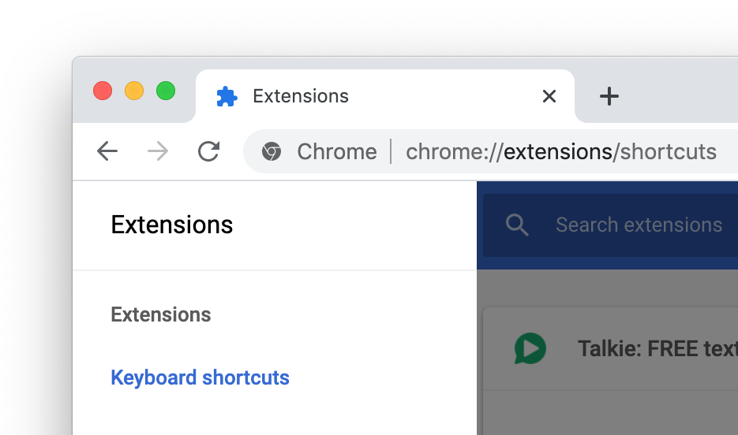

  

<h1 align="center">
  <a href="https://joelpurra.com/projects/talkie/">Talkie</a>
</h1>

  Text-to-speech browser extension button

<table>
  <tr>
    <td align="center">
      <a href="https://chrome.google.com/webstore/detail/enfbcfmmdpdminapkflljhbfeejjhjjk">  Talkie</a> &nbsp;
    </td>
    <td align="center">
      <a href="https://chrome.google.com/webstore/detail/madmpgibncancdmkjflnifcdakndkngo">  Talkie Premium</a> &nbsp;
    </td>
  </tr>
  <tr>
    <td align="center">
      <a href="https://addons.mozilla.org/en-US/firefox/addon/talkie/">  Talkie</a> &nbsp;
    </td>
    <td align="center">
        Talkie Premium (Coming soon!)
    </td>
  </tr>
</table>

## Installation

-  Google Chrome
  - Get <a href="https://chrome.google.com/webstore/detail/enfbcfmmdpdminapkflljhbfeejjhjjk"> Talkie</a> in the Chrome Web Store.
  - Get <a href="https://chrome.google.com/webstore/detail/madmpgibncancdmkjflnifcdakndkngo"> Talkie Premium</a> in the Chrome Web Store.
-  Firefox
  - Get <a href="https://addons.mozilla.org/en-US/firefox/addon/talkie/"> Talkie</a> at Firefox Add-ons.
  - Get  Talkie Premium at Firefox Add-ons. (Coming soon!)
- Developer option: [use the source code](DEVELOP.md) directly.

## Install additional voices

New voices, languages, dialects can be downloaded *for free* for your operating system from for example Microsoft and Apple. Once installed correctly just restart your computer, and Talkie will auto-detect the voices.

- [Windows 10](https://support.office.com/en-us/article/How-to-download-Text-to-Speech-languages-for-Windows-10-d5a6b612-b3ae-423f-afa5-4f6caf1ec5d3): Settings &gt;&nbsp;Time&nbsp;&amp;&nbsp;Language &gt;&nbsp;Language <!-- TODO: translate system settings path. -->
- [Windows 8](https://support.office.com/en-us/article/How-to-download-Text-to-Speech-languages-for-Windows-4c83a8d8-7486-42f7-8e46-2b0fdf753130)
- [Windows 7](https://www.microsoft.com/en-us/download/details.aspx?id=27224)
- [ChromeOS](https://support.google.com/chromebook/answer/9032490): Settings &gt;&nbsp;Manage&nbsp;accessibility&nbsp;features &gt;&nbsp;Text-to-Speech&nbsp;voice&nbsp;settings &gt;&nbsp;Speech&nbsp;Engines <!-- TODO: translate system settings path. -->
- [macOS](https://support.apple.com/kb/index?page=search&q=VoiceOver+language&product=PF6&doctype=PRODUCT_HELP,HOWTO_ARTICLES&locale=en_US): System&nbsp;Preferences &gt;&nbsp;Accessibility &gt;&nbsp;Speech &gt;&nbsp;System&nbsp;voice &gt;&nbsp;Customize... <!-- TODO: translate system settings path. -->

## Usage

1. **Select desired text** on any web page.
1. **Click the Talkie button** in your browser toolbar ↗︎↗︎↗︎ 

You can also **select the text, then right click on it**, and choose  Talkie in the menu. This way also works in PDF-files and some *special* types of pages in the browser.

In  Talkie Premium, you can **read any text copied to your clipboard** — use it with a shortcut key to listen to text from **anywhere outside of the browser**. You can also right-click on the Talkie Premium button, or in an empty area of a website, and select *read from clipboard*.

## Shortcut keys

A fast, easy, and convenient option is to use Talkie's configurable keyboard shortcuts.

| Feature | Version | Windows, Linux, ChromeOS | macOS |
| --- | --- | --- | --- |
| Start/stop | &nbsp; | <kbd>Alt</kbd>+<kbd>Shift</kbd>+<kbd>A</kbd> | <kbd>⌥</kbd>+<kbd>Shift</kbd>+<kbd>A</kbd> |
| Start/stop and show menu | &nbsp; | <kbd>Ctrl</kbd>+<kbd>Shift</kbd>+<kbd>A</kbd> | <kbd>⌘</kbd>+<kbd>Shift</kbd>+<kbd>A</kbd> |
| Read text from clipboard in any program |  | <kbd>Ctrl</kbd>+<kbd>Shift</kbd>+<kbd>1</kbd> | <kbd>⌘</kbd>+<kbd>Shift</kbd>+<kbd>1</kbd> |

If the shortcut key does not work, please check that it is not already in use by another extension or program.

  
<em>How to check or change the Talkie shortcut keys in Google Chrome</em>

  <ol>
    <li>
      In Chrome, click <em><a href="chrome://extensions/">Extensions</a></em> in the <em>Window</em> menu.
    </li>
    <li>
      At the bottom of the extensions list, click <em><a href="chrome://extensions/shortcuts">Keyboard shortcuts</a></em> in the left side menu.
      <blockquote>
        

          
        

      </blockquote>
    </li>
    <li>
      From the <em>Keyboard Shortcuts</em> window you can check or change keyboard shortcuts for all Chrome extensions and apps. This way you also can verify that there are no shortcut key collisions between extensions.
      <blockquote>
        

          
        

      </blockquote>
    </li>
  </ol>
  

    You can also reach the extensions page directly with <a href="chrome://extensions/"><code>chrome://extensions/</code></a> and the keyboard shortcut configuration with <a href="chrome://extensions/shortcuts"><code>chrome://extensions/shortcuts</code></a>, but you might have to copy-paste the address manually.
  

  
<em>How to check or change the Talkie shortcut keys in Firefox</em>

  <ol>
    <li>
      In Firefox, click <em><a href="about:addons">Add-ons</a></em> in the <em>Tools</em> menu.
    </li>
    <li>
      From the Add-ons page, click Extensions in the left side menu.
      <blockquote>
        

          
        

      </blockquote>
    </li>
    <li>
      At the top right of the extensions list, click <em>Manage extension shortcuts</em> in the gear button menu.
      <blockquote>
        

          
        

      </blockquote>
    </li>
    <li>
      From the <em>Manage extension shortcuts</em> window you can check or change extension shortcuts for all Firefox extensions. This way you also can verify that there are no shortcut key collisions between extensions.
      <blockquote>
        

          
        

      </blockquote>
    </li>
  </ol>
  

    You can also reach the extensions page directly with <a href="about:addons"><code>about:addons</code></a>, but you might have to copy-paste the address manually.
  

## Features in  Talkie Premium

- **Choose your own default voice** for each language. Great if you get tired of the system voice!
- Choose reading **speed and pitch per voice**. Adjust voices to your liking!
- **Read text from the clipboard!** Just copy text from anywhere in any program, and use Talkie Premium to read it!
- That **warm, fuzzy feeling** you get when supporting open source software by independent developers.
- Future Premium **updates included for free**.
- Plus **all features** below.

## Features in  Talkie

- Lets you listen to the selected text on any part of a page — **short snippets or entire news articles**. Just highlight what you want to hear read aloud and hit play.
- Automatically **detects the text language** per-page, and chooses a voice in the same language to match it.
- **Privacy aware** — no unnecessary tracking or external services.
- Free!

## Notes

  
<em>Web Speech API</em>

  

    Uses your browser's built-in <a href="https://www.w3.org/community/speech-api/">Web Speech API for text-to-speech (TTS)</a> known as <a href="https://dvcs.w3.org/hg/speech-api/raw-file/9a0075d25326/speechapi.html#tts-section">Speech Synthesis</a>.
  

  <ul>
    <li>
      As the Web Speech API is implemented by your browser, your browser selection and settings may affect Talkie.
    </li>
    <li>
      All text and speech is processed internally by your browser. While ultimately depending on your specific browser, processing is expected to be done on your own machine and not use a server.
    </li>
    <li>
      Sound is only produced, never recorded.
    </li>
  </ul>

  
<em>Language detection</em>

  

    Not all languages are supported; consult your browser's voice documentation.
  

  

    The language detection is done in four steps, where the first valid value is chosen. If no language was detected, a notice is spoken (in English).
  

  <ol>
    <li>
      Your browser's text language detection for the selection, using word and sentence analysis.
    </li>
    <li>
      The first available <code>lang="..."</code> attribute from the selected text's parent HTML elements.
    </li>
    <li>
      The <code>lang="..."</code> attribute from the HTML root element of the current page (or frame).
    </li>
    <li>
      Your browser's page primary language detection.
    </li>
  </ol>

  

    The Web Speech API can use more than one voice per language (currently over 20 for <code>en-US</code> in Google Chrome version 55), as well as modify speech rate (speed) and pitch. These options have been implemented in  Talkie Premium as a paid feature for those who install the extension through the <a href="https://chrome.google.com/webstore/detail/madmpgibncancdmkjflnifcdakndkngo">Chrome Web Store</a> or <a href="https://joelpurra.com/projects/talkie/#premium">Firefox Add-ons</a>.
  

  
<em>Installing voices</em>

  

    The voices for each language are provided by your browser. For this reason the list may differ depending on your browser, browser version, operating system, and any other installed extensions/software.
  

  

    To see the list of languages/voices available in your specific browser, as well as speak out sample text, check the Talkie options page after installation. This is a good start in figuring out why a certain language might not be read out loud as expected.
  

  

    You can install additional voices to support new languages and dialects; see separate installation instructions for your operating system.
  

  
<em>Example list of voices available in Google Chrome version 55 on macOS</em>

  

    The total number of voices is 83.
  

  <ul>
    <li><strong>ar-SA:</strong> Tarik</li>
    <li><strong>cs-CZ:</strong> Zuzana</li>
    <li><strong>da-DK:</strong> Sara</li>
    <li><strong>de-DE:</strong> Anna, Google Deutsch</li>
    <li><strong>el-GR:</strong> Melina</li>
    <li><strong>en:</strong> Fiona</li>
    <li><strong>en-AU:</strong> Karen</li>
    <li><strong>en-GB:</strong> Daniel, Google UK English Female, Google UK English Male</li>
    <li><strong>en-IE:</strong> Moira</li>
    <li><strong>en-IN:</strong> Veena</li>
    <li><strong>en-US:</strong> Agnes, Albert, Alex, Bad News, Bahh, Bells, Boing, Bruce, Bubbles, Cellos, Deranged, Fred, Good News, Google US English, Hysterical, Junior, Kathy, Pipe Organ, Princess, Ralph, Samantha, Trinoids, Vicki, Victoria, Whisper, Zarvox</li>
    <li><strong>en-ZA:</strong> Tessa</li>
    <li><strong>es-AR:</strong> Diego</li>
    <li><strong>es-ES:</strong> Google español, Monica</li>
    <li><strong>es-MX:</strong> Paulina</li>
    <li><strong>es-US:</strong> Google español de Estados Unidos</li>
    <li><strong>fi-FI:</strong> Satu</li>
    <li><strong>fr-CA:</strong> Amelie</li>
    <li><strong>fr-FR:</strong> Google français, Thomas</li>
    <li><strong>he-IL:</strong> Carmit</li>
    <li><strong>hi-IN:</strong> Google हिन्दी, Lekha</li>
    <li><strong>hu-HU:</strong> Mariska</li>
    <li><strong>id-ID:</strong> Damayanti, Google Bahasa Indonesia</li>
    <li><strong>it-IT:</strong> Alice, Google italiano</li>
    <li><strong>ja-JP:</strong> Google 日本語, Kyoko</li>
    <li><strong>ko-KR:</strong> Google 한국의, Yuna</li>
    <li><strong>nb-NO:</strong> Nora</li>
    <li><strong>nl-BE:</strong> Ellen</li>
    <li><strong>nl-NL:</strong> Google Nederlands, Xander</li>
    <li><strong>pl-PL:</strong> Google polski, Zosia</li>
    <li><strong>pt-BR:</strong> Google português do Brasil, Luciana</li>
    <li><strong>pt-PT:</strong> Joana</li>
    <li><strong>ro-RO:</strong> Ioana</li>
    <li><strong>ru-RU:</strong> Google русский, Milena</li>
    <li><strong>sk-SK:</strong> Laura</li>
    <li><strong>sv-SE:</strong> Alva</li>
    <li><strong>th-TH:</strong> Kanya</li>
    <li><strong>tr-TR:</strong> Yelda</li>
    <li><strong>zh-CN:</strong> Google 普通话（中国大陆）, Ting-Ting</li>
    <li><strong>zh-HK:</strong> Google 粤語（香港）, Sin-ji</li>
    <li><strong>zh-TW:</strong> Google 國語（臺灣）, Mei-Jia</li>
  </ul>

## Acknowledgements

- Thanks to [Liron Tocker](https://liron.de/) for coming up with the name Talkie, the fancy icons, and promotional graphics (2016-12-31, 2017-04-09):   
- Thanks to [Miroslava Jovičić](http://www.miroslavajovicic.net/) for the fancy user interface redesign (2017-05-29), and promotional graphics (2017-07-30, 2017-08-01).

---

<a href="https://joelpurra.com/projects/talkie/"> Talkie</a> Copyright &copy; 2016, 2017, 2018, 2019, 2020 [Joel Purra](https://joelpurra.com/). Released under [GNU General Public License version 3.0 (GPL-3.0)](https://www.gnu.org/licenses/gpl.html). [Your donations are appreciated!](https://joelpurra.com/donate/)
